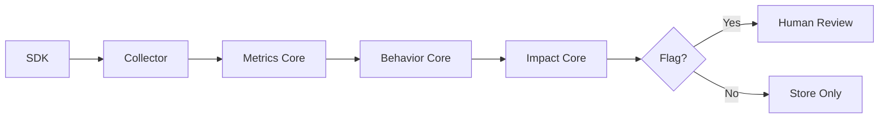

# @causality/behavior-core

Behavioral consistency analysis for causal actions.

> **Phase 6** — Behavior Analysis Core

## Overview

Analyzes traces and metrics to identify actions whose resource consumption is **anomalous** compared to historical patterns. Produces **deterministic, structured evidence** for human review.

**Key principles:**

- No automatic alerts — decision goes to Impact Core
- No fixes or suggestions — only evidence
- Deterministic output — same input → same output
- Single occurrences ignored — patterns are flagged

## Installation

```bash
npm install @causality/behavior-core
```

## Quick Start

```typescript
import { createBehaviorAnalyzer, toImpactJson } from "@causality/behavior-core";

const analyzer = createBehaviorAnalyzer();

// Step 1: Record executions to build history
for (const metrics of historicalMetrics) {
  analyzer.recordExecution(metrics);
}

// Step 2: Analyze current execution
const result = analyzer.analyzeWithStoredHistory(
  {
    actionName: "ProcessPayment",
    traceId: "trace-123",
    service: "payment-api",
    userId: "user-456",
  },
  currentMetrics,
  {
    file: "src/payment/processor.ts",
    function: "processPayment",
  }
);

// Step 3: Check if flagged for review
if (result?.shouldFlag) {
  console.log(result.anomaly.reason);
  // "Latency 500ms exceeds expected ~100ms (5.0σ above mean)"

  // Output JSON for Impact Core
  console.log(toImpactJson(result));
}
```

## Core Concepts

### Behavioral Anomaly

Structured evidence when metrics deviate from history:

```typescript
interface BehaviorAnomaly {
  actionName: string;
  file: string;
  function: string;
  metricsObserved: {
    durationMs: number;
    cpuDelta: number;
    memoryDeltaMb: number;
    eventLoopLagMs?: number;
  };
  metricsExpected: {
    cpu: "low" | "medium" | "high";
    memory: "low" | "medium" | "high";
    durationMs: number;
  };
  observedAnomaly: boolean;
  confidence: number; // 0-1
  repeatSensitivity: "singleOccurrence" | "flag";
  reason: string;
}
```

### Repeat Sensitivity

| Classification     | When                                  | Action          |
| ------------------ | ------------------------------------- | --------------- |
| `singleOccurrence` | First/few occurrences, low confidence | Ignore          |
| `flag`             | Repeated pattern, high confidence     | Flag for review |

### Anomaly Types

| Type               | Description                           |
| ------------------ | ------------------------------------- |
| `latency_spike`    | Duration significantly above baseline |
| `cpu_anomaly`      | CPU usage above expected              |
| `memory_anomaly`   | Memory consumption above expected     |
| `combined_anomaly` | Multiple resources anomalous          |

## Output JSON Format

Ready for Impact Core integration:

```json
{
  "actionName": "ProcessPayment",
  "file": "src/payment/processor.ts",
  "function": "processPayment",
  "metricsObserved": {
    "durationMs": 500,
    "cpuDelta": 30,
    "memoryDeltaMb": 80,
    "eventLoopLagMs": 15
  },
  "metricsExpected": {
    "cpu": "low",
    "memory": "medium",
    "durationMs": 100
  },
  "observedAnomaly": true,
  "confidence": 0.85,
  "repeatSensitivity": "flag",
  "reason": "Latency 500ms exceeds expected ~100ms (5.0σ above mean 100ms)"
}
```

## API Reference

### BehaviorAnalyzer

Stateful analyzer maintaining history and occurrence counts:

```typescript
import { createBehaviorAnalyzer } from "@causality/behavior-core";

const analyzer = createBehaviorAnalyzer({
  minSamplesForBaseline: 10, // Minimum history before analysis
  stdDevThreshold: 2.0, // Standard deviations for anomaly
  minOccurrencesToFlag: 3, // Repetitions before flagging
  confidenceThreshold: 0.7, // Confidence required to flag
});

// Record execution
analyzer.recordExecution(metrics);

// Analyze with stored history
const result = analyzer.analyzeWithStoredHistory(context, metrics, source);

// Quick anomaly check
if (analyzer.isAnomalous(metrics)) {
  /* ... */
}

// Check if analysis is possible
if (analyzer.canAnalyze("ActionName")) {
  /* ... */
}

// Export/import state for persistence
const state = analyzer.export();
analyzer.import(state);
```

### Stateless Analysis

For one-off analysis without maintaining state:

```typescript
import { analyzeBehavior } from "@causality/behavior-core";

const result = analyzeBehavior({
  context: { actionName: "Test", traceId: "trace-1" },
  metrics: currentMetrics,
  history: historicalData,
  source: { file: "test.ts", function: "test" },
});
```

### History Store

Direct access to execution history:

```typescript
import { createHistoryStore } from "@causality/behavior-core";

const store = createHistoryStore();

store.record(metrics);

const history = store.get("ActionName");
// { actionName, sampleCount, stats: { duration, cpu, memory } }

if (store.hasReliableHistory("ActionName", 10)) {
  /* ... */
}
```

### Baseline Calculation

```typescript
import {
  calculateBaseline,
  calculateDeviation,
  exceedsBaseline,
} from "@causality/behavior-core";

const baseline = calculateBaseline(history);
const deviation = calculateDeviation(observed, history.stats.duration);

if (exceedsBaseline(observed, stats, 2.0)) {
  /* ... */
}
```

## Integration with Pipeline



### Full Example

```typescript
import { MetricsCollector } from "@causality/metrics-core";
import { createBehaviorAnalyzer } from "@causality/behavior-core";
import { assessImpact } from "@causality/impact-core";

const metricsCollector = new MetricsCollector();
const behaviorAnalyzer = createBehaviorAnalyzer();

// On each action event
onActionEvent((event) => {
  metricsCollector.ingest(event);
});

// When action completes
const actionMetrics = metricsCollector.getMetrics("action-id");

// Record for history
behaviorAnalyzer.recordExecution(actionMetrics);

// Analyze for anomalies
const behaviorResult = behaviorAnalyzer.analyzeWithStoredHistory(
  context,
  actionMetrics,
  source
);

if (behaviorResult?.shouldFlag) {
  // Feed to Impact Core
  const assessment = assessImpact(explanation, {
    occurrences: behaviorResult.occurrenceCount,
    windowMs: 3600000,
    affectedPercentage: calculateAffectedPercentage(),
  });

  if (assessment.shouldNotify) {
    // Alert appropriate audience
  }
}
```

## Guarantees

| Guarantee            | Implementation                    |
| -------------------- | --------------------------------- |
| **Deterministic**    | Same input → same JSON output     |
| **No auto-alerts**   | Only evidence, decision to Impact |
| **No fixes**         | Only reports deviation            |
| **History-based**    | Requires sufficient samples       |
| **Repeat-sensitive** | Single occurrences ignored        |

## Configuration

```typescript
interface BehaviorAnalysisConfig {
  minSamplesForBaseline?: number; // Default: 10
  stdDevThreshold?: number; // Default: 2.0
  minOccurrencesToFlag?: number; // Default: 3
  confidenceThreshold?: number; // Default: 0.7
}
```

## Requirements

- Node.js >= 18.0.0
- @causality/metrics-core >= 0.1.0
- @causality/impact-core >= 0.1.0

## License

MIT
