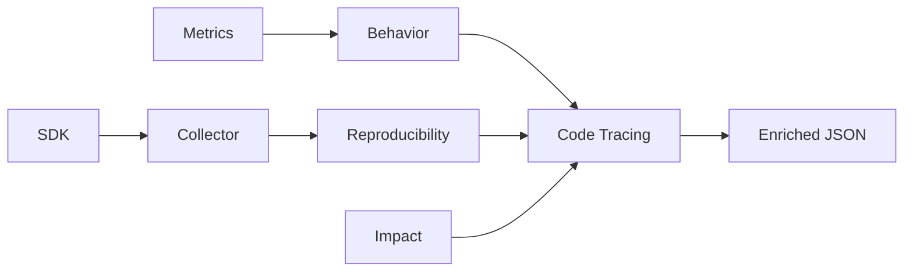

# @causality/code-tracing-core

Code analysis and cross-service trace propagation for causality explanations.

> **Phase 7** — Code Tracing Core

## Overview

Enriches causal traces with:

- **Code Context:** Maps actions to specific files and functions.
- **Service Propagation:** Tracks flow across frontend, gateway, microservices, and databases.
- **Unified Findings:** Integrates anomalies from Behavior Core and Impact Core.
- **Reproducibility:** Generates step-by-step replay instructions.

## Installation

```bash
npm install @causality/code-tracing-core
```

## Quick Start

```typescript
import { createCodeTracer, toJson } from "@causality/code-tracing-core";

// 1. Create Tracer
const tracer = createCodeTracer();

// 2. Register Mappings (optional, can be inferred)
tracer.registerCode("ProcessPayment", {
  file: "src/payment/processor.ts",
  function: "processPayment",
});

tracer.registerService("ProcessPayment", {
  name: "payment-service",
  type: "microservice",
  endpoint: "/api/v1/payments",
});

// 3. Enrich Explanation
const enriched = tracer.enrich(
  reproducibilityExplanation,
  behaviorResult,
  impactAssessment
);

// 4. Output JSON
console.log(toJson(enriched));
```

## Output Format

Produces a comprehensive JSON structure describing the entire failure scenario:

```json
{
  "traceId": "trace-123",
  "actionName": "ProcessPayment",
  "service": "microservice",
  "file": "src/payment/processor.ts",
  "function": "processPayment",
  "inputs": {
    "userId": "user-456",
    "amount": 100
  },
  "metricsObserved": {
    "durationMs": 500,
    "cpuDelta": 30
  },
  "anomalies": [
    {
      "type": "latency_spike",
      "deviationMagnitude": 5.0,
      "confidence": 0.85,
      "reason": "Latency 500ms exceeds expected ~100ms"
    }
  ],
  "causalChain": [
    {
      "actionName": "ProcessPayment",
      "service": "payment-service",
      "file": "src/payment/processor.ts",
      "status": "error"
    }
  ],
  "replayInstructions": [
    {
      "step": 1,
      "type": "action",
      "action": "ProcessPayment",
      "description": "Execute \"ProcessPayment\" on microservice in src/payment/processor.ts::processPayment"
    }
  ],
  "impactScore": 75,
  "policyAction": "alert"
}
```

## Features

### 1. Code Analysis

Automatically maps action names to code locations using patterns or explicit registry.

```typescript
// Infers: src/payment/processor.ts
const codeContext = inferCodeContext("ProcessPayment");
```

### 2. Service Propagation

Tracks requests across service boundaries:

- **Frontend:** `Render*`, `Click*`
- **Gateway:** `Route*`, `Proxy*`
- **Microservices:** Business logic actions
- **Database:** `Query*`, `Insert*`, `Update*`

### 3. Replay Instructions

Generates human-readable reproduction steps:

1. 🔧 **Step 1:** Prepare inputs
2. ▶️ **Step 2:** Execute "ProcessPayment"
3. ✅ **Step 3:** Verify issue

## Integration

Use as the final stage of the Causality pipeline to produce the `EnrichedExplanation`.



## License

MIT
